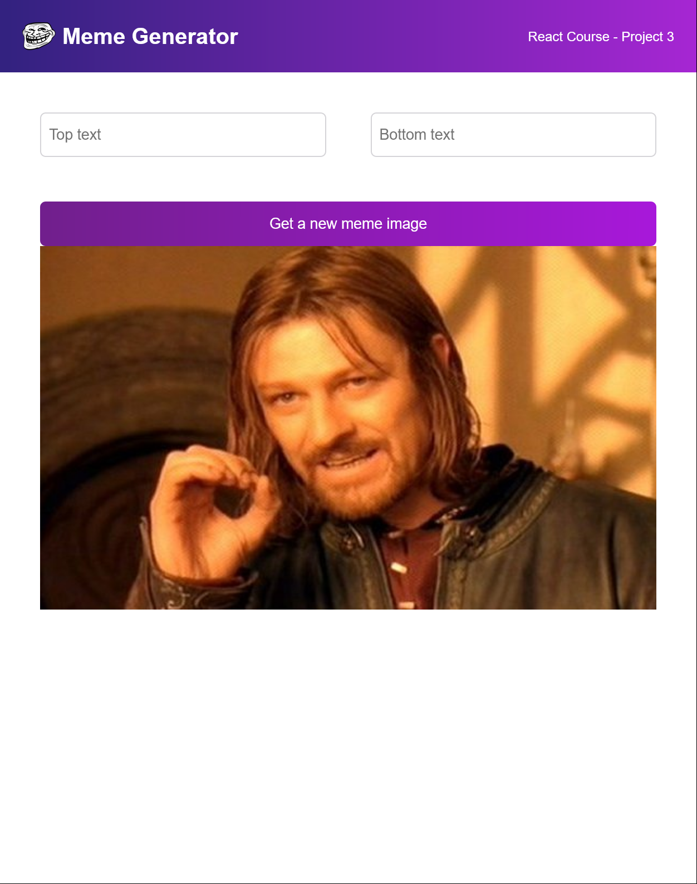

# Meme Generator

This is a solution to the Meme Generator project on Scrimba. Scrimba helps you improve your coding skills by building realistic projects.

## Table of Contents

    Overview
        Challenge
        Screenshot
        Getting Started with Create React App
    My process
        Built with
        What I learned
        Useful resources
    Author

## Overview

<h3>The challenge</h3>

    Write top and bottom texts on memes via React form
    Get a random meme image calling APIs
    
<h3>Screenshot</h3>

<h3>Getting Started with Create React App</h3>

This project was bootstrapped with Create React App.
## My Process

<h3>Built with</h3>

    Semantic HTML5 markup
    CSS custom properties
    React.JS
    Flexbox
    CSS Grid

<h3>What I learned</h3>

React basis like:

    Event listeners
    State
    Conditional rendering
    Forms
    Side effects

<h3>Useful resources</h3>

    ReactJS - How to set up a local development environment on your computer
    StackOverflow - How to push a footer to the bottom of page when content is short or missing

## Author

 Patrick Pachacz
